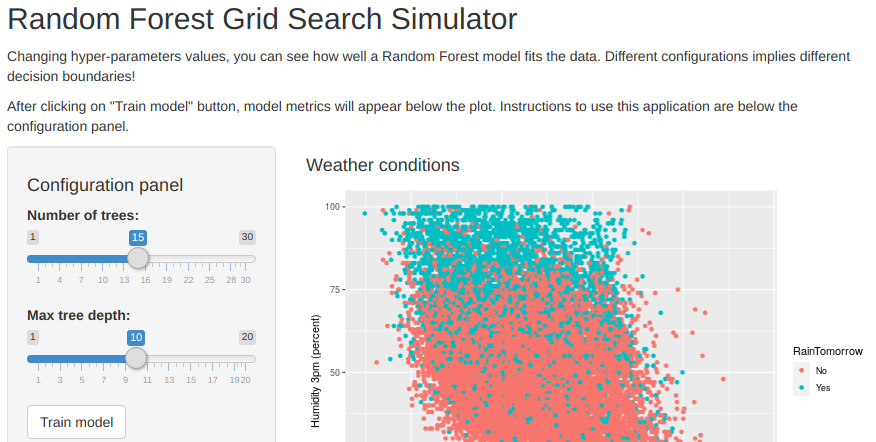

```{r setup, include=FALSE}
knitr::opts_chunk$set(echo = FALSE)
```

## Introduction

Hyper-parameters optimization is an important step to build Machine Learning solutions. [Random Forest Grid Search simulator](https://ricardoleoncorreia.shinyapps.io/RainApp/) helps the user to understand how the results of a classification model are being affected after changing the algorithm hyper-parameters.

Shiny app backend characteristics:

- **Machine Learning Model:** Random Forest.

- **Dataset:** Subset of 20.000 random observations from [Australia Rain dataset](https://www.kaggle.com/jsphyg/weather-dataset-rattle-package).

- **Train/test split:** 80% training - 20% test.

- **Chosen predictors:** MaxTemp and Humidity3pm.

- **Hyper-parameters to tune up:** number of trees and maximum tree depth.

Code for Shiny app and this pitch can be found on [Github](https://github.com/ricardoleoncorreia/shiny-rain-app).

## User Interface

<center>

</center>

## User instructions

The simulator is easy to use! Just follow the steps below:

1. Select number of trees.

2. Select maximum tree depth.

3. Click on "Train model".

4. Enjoy!

## Result | Decision boundary plot

```{r cache=TRUE, message=FALSE, fig.height=5, fig.width=7, fig.align="center"}
library(ggplot2); library(caret); library(ranger); library(e1071); library(dplyr);

num.trees <- 10
max.depth <- 70

weather.data <- read.csv('../RainApp/weatherAUS.csv')

trainIndex <- createDataPartition(weather.data$RainTomorrow, p=0.80, list=FALSE)

train <- weather.data[trainIndex,]
test <- weather.data[-trainIndex,]

rf.fit <- ranger(RainTomorrow ~ .,
                 data = train,
                 num.trees = num.trees,
                 write.forest = TRUE,
                 max.depth = max.depth,
                 seed = 42)

train.pred <- predict(rf.fit, data = train)$predictions
test.pred <- predict(rf.fit, data = test)$predictions

train.accuracy <- confusionMatrix(train.pred, train$RainTomorrow)$overall['Accuracy']
test.accuracy <- confusionMatrix(test.pred, test$RainTomorrow)$overall['Accuracy']

resolution <- 50
data.range <- sapply(weather.data %>% select(MaxTemp, Humidity3pm), range, na.rm = TRUE)
xs <- seq(data.range[1,1], data.range[2,1], length.out = resolution)
ys <- seq(data.range[1,2], data.range[2,2], length.out = resolution)
mesh.grid <- cbind(rep(xs, each=resolution), rep(ys, time = resolution))
colnames(mesh.grid) <- colnames(data.range)
mesh.grid <- as.data.frame(mesh.grid)
mesh.pred <- predict(rf.fit, data=mesh.grid)$predictions

ggplot()+
  geom_point(data= weather.data, aes(x=MaxTemp, y=Humidity3pm, color=RainTomorrow))+
  geom_contour(data= NULL, aes(x=mesh.grid$MaxTemp, y=mesh.grid$Humidity3pm, z=as.numeric(mesh.pred)), breaks=c(1.5), color="black", size=1)
```